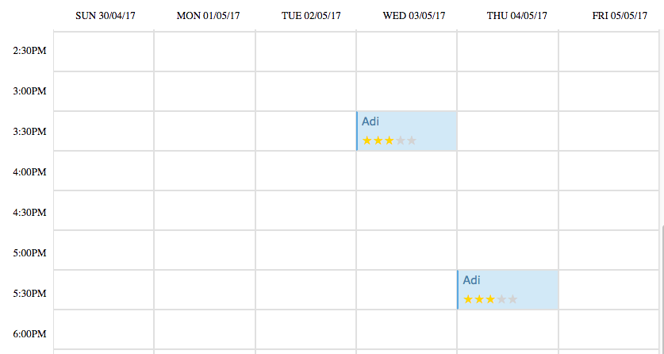
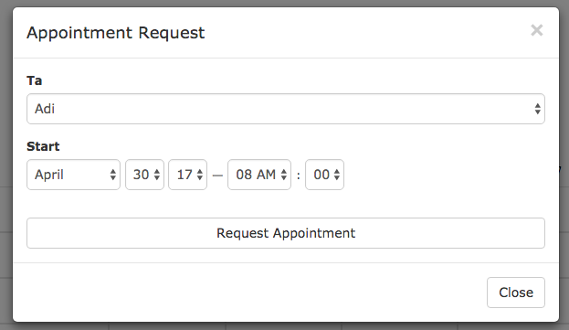
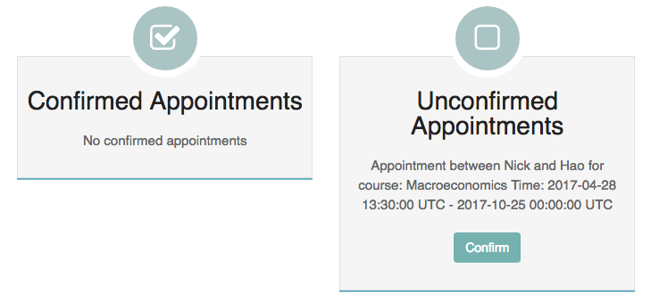
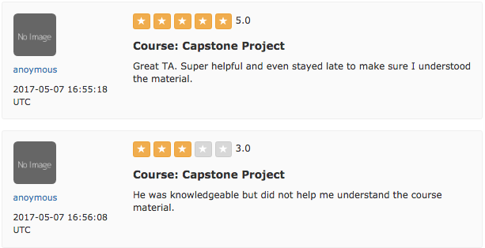

# TAOnDemand 
##### *created by: Nick, Horace, Adi*

##### Problem:
###### If you have ever been to college before, then you know that it can be difficult to track down your TA, as well as figure out when one of their office hours are.  Furthermore, we all oknow the struggle of trying to finda  time to make an appointment with one of your teaching assistants.

Some key features are:
* Complex schema
* A dynamic schedule that students and teaching assistants can interact with on the course pages
<!----------->
* Providing a way to create and update office hour in a nicely organized calendar
* confirm and create appointments

<!----------->
* Connecting students and TA through a chat feature for those office hours that are online
* Making TA's mre accountable by allowing students to rate and review their TAs, and making those reviews public
 
