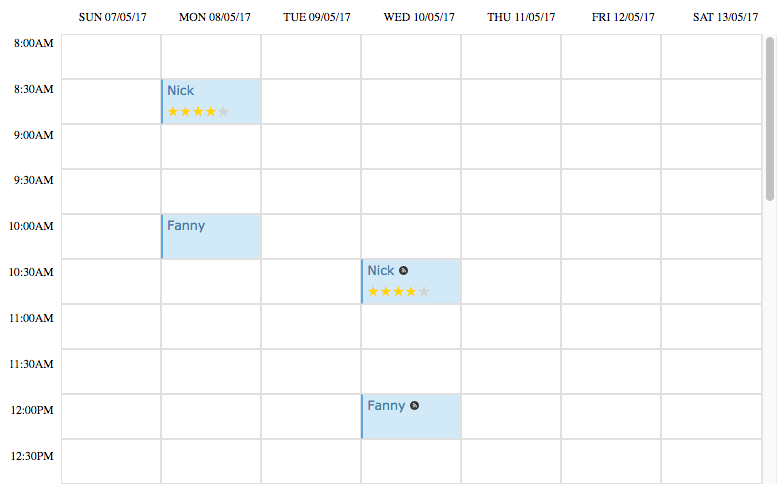
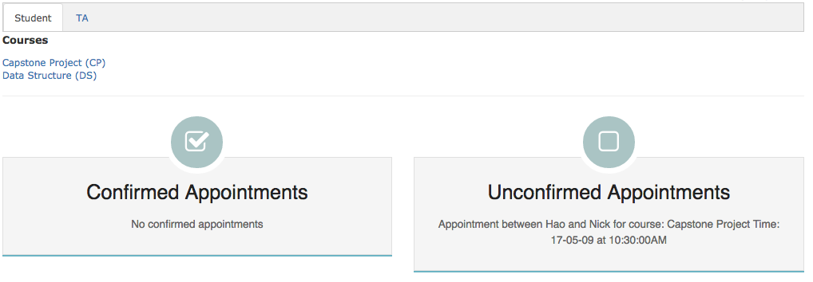
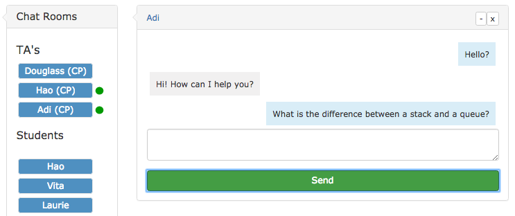
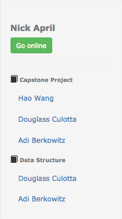

# TA OnDemand 
##### *created by: Nick April, Horace Wang, Adi Berkowitz*

### Brief Overview:
TA OnDemand is a Ruby on Rails application designed to improve the relationship between teaching assistants and students in large University classes. 

Key features:
* Complex schema
* A dynamic scheduler
* Teaching Assistant ratings and reviews
* Live Chat

### Introduction:

Most higher education institutions incorporate some form of Teaching Assistants (TAs) into their classes. TAs are typically undergraduate or graduate students who help students learn course material by providing in-person or online assistance, usually called office hours. The office hour schedules are made at the beginning of the semester and are usually available to students as a pdf online. This system works, and it is simple, but it is not terribly efficient. We estimate that around 15% of students will seek help from a TA at a given time. In large classes, office hour demand quite often exceeds its capacity. The result for students is not only long wait times but also frustration for those who have short but crucial questions. 

TA OnDemand addresses these problems by standardizing office hour scheduling and providing a space for virtually hosted office hours. Our overarching goals were efficiency and convenience. We hypothesized that, with the right application, TAs would become more accessible to students. And furthermore, that by making it easier to meet, we could connect more students seeking help, with the TAs who want to do so. Ultimately, we hope this app will encourage interaction among TAs and students and therefore improve the quality of student learning.

### Overview of Features:

TA OnDemand accomplishes these goals by automating the relationship between students and TAs in three different ways.

1. Dynamic scheduler
2. Appointments
3. Live chat

#### Scheduler & Appointments
- Appears on each course page to show the weekly office hour schedule for the given class
- Appears on the users home page with the office hour schedule from all of their classes integrated as well as their own office hours if they are a TA
- TAs can easily create or change their office hours by clicking on a time slot

- Students can request to meet outside of the regular office hours by clicking on an empty time slot. Both the student and the TA can view the status of appointment requests on their own profile page.

#### Live Chat
- Students and TAs can chat live. This can allow a TA to completely virtualize his/her office hour by fielding questions online.
- TAs can "Go Online" by clicking a button in the sidebar. Once online, a green circle will show up next to their name for students looking to chat with them

#### Reviews
- Each student can rate their TAs based on a 5-point scale and a written review
- Each TA has a TA Profile page which shows their average rating and all the comments given by any of their students. This allows TAs to build a reputation, making them more likely to be hired by professors and can go on their resume.

### Technology
TA OnDemand uses technology beyond Ruby on Rails including Javascript, Amazon Web Services and Action Cable. 

#### JavaScript
We were surprised at how much JavaScript we had to use in this App. We had no JavaScript experience before building this application so we learned while developing this App. JavaScript is used in the TA review feature to make the live search function and the star ratings update in real time. JavaScript is also used in the live chat feature to support action cable.

#### Action Cable
Action cable was a big challenge. We used it in the Live Chat featue to seamlessly integrate WebSockets into our Rails application. This integration is what makes real-time messaging possible in our Live Chat feature. It also supports multiple channels from a single user, allowing someone to hold many private conversations at once. This was a challenging feature because it required a strong understanding of WebSockets, Channels and JavaScript.

#### Schema
TA OnDemand is built on a rich and complicated backend schema. We spent many hours developing our schema due to complicated User relationships. Since a user might have two identities, student and TA, we implemented two associative tables between User and Course: Enrollment and Enrollment_ta.  We also assigned alias names for tables, like tacourses, to make our queries straightforward and our development simpler.

